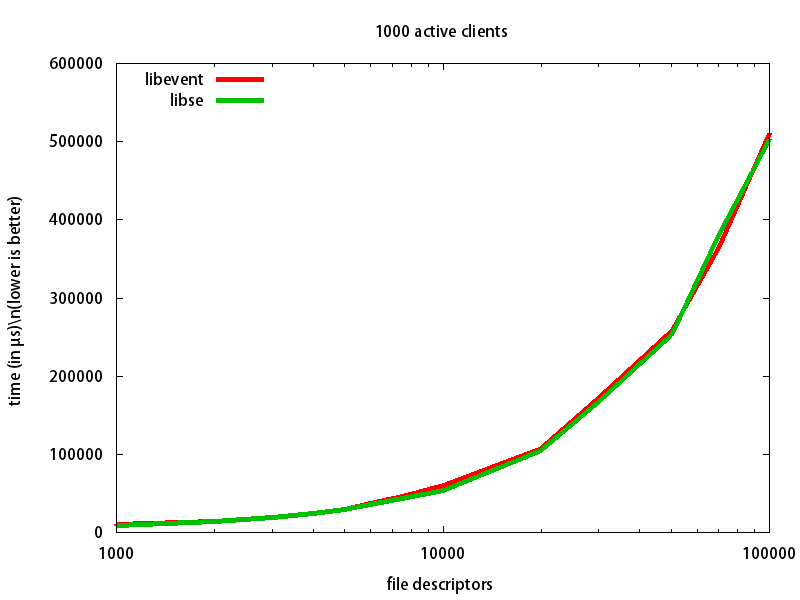

#Brief Introduction

libse is a simple event driven library. libse will execute a callback function when a event occurs on a file descriptor. Currently, libse supports epoll and select.

#Usage

the usage of libse is quite simple, the following code is a example:

[event_test.c](test/event_test.c)

with the above code, do the following to run it:

    cd src/
    make //generate the libse.so
    cp libse.so /usr/lib64/(or usr/lib/)
	gcc event_test.c -lse -o event.test
	./event.test

#Benchmarking

We use the libevent benchmark program [bench-libevent](http://libev.schmorp.de/bench.c), and we provide a benchmark with same function using libse([bench-libevent](benchmark/bench.c)). For libevent, version 2.0.21-stable is used. The test program run on a two way quad-core Intel(R) Xeon(R) CPU           E5620  @ 2.40GHz. Both libraries were configured to use the epoll interface. The detailed results are as follows:

#Todo

- add kqueue support
- add timeout support
- etc...

